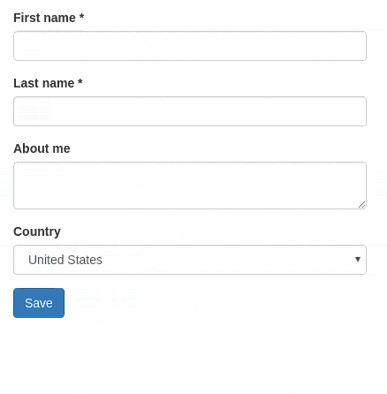

# ember-validated-form
[](https://badge.fury.io/js/ember-validated-form)
[](http://emberobserver.com/addons/ember-validated-form)
[](https://travis-ci.org/adfinis-sygroup/ember-validated-form)

Easily create forms with client side validations.

## Demo



Want to try it yourself? [See the live demo.](https://adfinis-sygroup.github.io/ember-validated-form/)

This [ember-cli](http://www.ember-cli.com) addon is based on the following excellent addons

- [ember-changeset](https://github.com/DockYard/ember-changeset)
- [ember-changeset-validations](https://github.com/DockYard/ember-changeset-validations/)
- [ember-one-way-controls](https://github.com/DockYard/ember-one-way-controls)

and provides a handy out-of-the-box setup for user-friendly client-side validations, featuring

- Hiding of validation errors until field has been interacted with (or submit button was pressed)
- Preventing submit action until form is valid
- Live-updating validation errors
- Bootstrap integration

## Why *YAEFA?
**Yet another ember form addon*

There are many [existing ember addons](https://emberobserver.com/categories/forms) with this style of API, the most prominent probably being [ember-form-for](https://github.com/martndemus/ember-form-for). With this addon, we want to:

- focus on forms that require client-side validations
- provide good user experience out of the box

## Usage

First, install the addon:
```
ember install ember-validated-form
```

Basic example:

```Handlebars
{{#validated-form
  model        = (changeset model UserValidations)
  on-submit    = (action "submit")
  submit-label = 'Save' as |f|}}

  {{f.input label="First name" name="firstName"}}
  {{f.input label="Last name" name="lastName"}}

  {{f.input type="textarea" label="About me" name="aboutMe"}}

  {{f.input
    type     = "select"
    label    = "Country"
    name     = "country"
    options  = countries
    value    = model.country
    }}

  {{f.input type="radioGroup" label="Gender" name="gender" options=genders}}

{{/validated-form}}
```

where `UserValidations` is a changeset:

```javascript
// controller
import Ember from 'ember';
import UserValidations from 'dummy/validations/user';

export default Ember.Controller.extend({
  UserValidations
});
```

```javascript
// validations/user.js
import {
  validatePresence,
  validateLength
} from 'ember-changeset-validations/validators';


export default {
  firstName: [
    validatePresence(true),
    validateLength({min: 3, max: 40})
  ],
  lastName: [
    validatePresence(true),
    validateLength({min: 3, max: 40})
  ],
  aboutMe: [ validateLength({allowBlank: true, max: 200}) ],
  country: [ validatePresence(true) ],
  gender: [ validatePresence(true) ]
};
```

## Options

`{{validated-form}}` takes the following options:

| Name         | Type     | Description                                                                                                                                |
| ----         | ----     | -----------                                                                                                                                |
| model        | `Object` | ember-changeset containing the model that backs the form                                                                                   |
| on-submit    | `Action` | Action, that is triggered on form submit. The changeset is passed as a parameter. If specified, a submit button is rendered automatically. |
| on-cancel    | `Action` | Same as `on-submit`, but for the `cancel` button.                                                                                          |
| submit-label | `String` | Label for the submit button. Overrides the value specified in the config.                                                                  |
| cancel-label | `String` | Label for the cancel button. Overrides the value specified in the config.                                                                  |

## Input fields

`{{validated-form}}` yields an object, that contains the [contextual component](http://emberjs.com/blog/2016/01/15/ember-2-3-released.html#toc_contextual-components) `input`. All input fields share some common properties:

| Name  | Type     | Description                                                                |
| ----  | ----     | -----------                                                                |
| label | `String` | The label of the form field.                                               |
| name  | `String` | This is is the name of the model property this input is bound to.          |
| type  | `Action` | Type of the form field (see supported field types below). Default: `text`. |

The supported field types are essentially given by [ember-one-way-controls](https://github.com/DockYard/ember-one-way-controls). This addon does not much more than translating `{{f.input type="select"}}` to `{{one-way-select}}`.

However, some field types require extra parameters. The supported field types are listed below.

### Text input

If no field type is specified, a simple `<input type="text">` is rendered. Other HTML5 text-like inputs like `email`, `number`, `search` require specifying their type. For more details see the docs of [{{one-way-input}}](https://github.com/DockYard/ember-one-way-controls/blob/master/docs/one-way-input.md).

```Handlebars
{{f.input label="First name" name="firstName"}}
{{f.input type="email" label="Email" name="email"}}
```

### Textarea

```Handlebars
{{f.input type="textarea" label="Description" name="description"}}
```

### Select

The select element requires more options (see [{{one-way-select}}](https://github.com/DockYard/ember-one-way-controls/blob/master/docs/one-way-select.md):

- `value`
- `options`
- `includeBlank`

```Handlebars
{{f.input
  type         = "select"
  label        = "Country"
  name         = "country"
  options      = countries
  includeBlank = "Please choose..."
  }}
```

### Radio button group

This component renders a list of [{{one-way-radio}}](https://github.com/DockYard/ember-one-way-controls/blob/master/docs/one-way-radio.md) components.

```Handlebars
{{f.input type="radioGroup" label="Gender" name="gender" options=genders}}
```

```javascript
// in your controller
genders: [{
  key: 'm',
  label: 'Male'
}, {
  key: 'f',
  label: 'Female'
}],
```

## Config

Currently, the configuration supports

- `label`: defaults for `submit-label` and `cancel-label`. If you're using [ember-i18n](https://github.com/jamesarosen/ember-i18n), you can also specify translation keys.
- `css`: CSS Classes to add to the form elements (`group`, `control`, `label`, `help`). See an example integration of bootstrap CSS below.

```javascript
// environment.js

var ENV = {
  // ...
  'ember-validated-form': {
    label: {
      submit: 'Go for it',
      cancel: 'Take me back'
    },
    css: {
      // bootstrap classes
      group: 'form-group',
      control: 'form-control',
      label: 'form-label',
      help: 'help-block'
    }
  },
  // ...
}
```


# Contributing

Bug reports, suggestions and pull requests are always welcome!

## Installation

* `git clone https://github.com/adfinis-sygroup/ember-validated-form`
* `cd ember-validated-form`
* `npm install`
* `bower install`

## Running

* `ember serve`
* Visit your app at [http://localhost:4200](http://localhost:4200).

## Running Tests

* `npm test` (Runs `ember try:each` to test your addon against multiple Ember versions)
* `ember test`
* `ember test --server`

## Building

* `ember build`

For more information on using ember-cli, visit [https://ember-cli.com/](https://ember-cli.com/).
